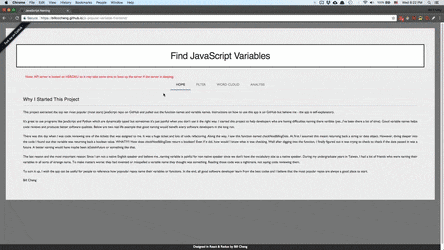

# Javascript Popular Variable Frontend
The website is deployed [here](https://billcccheng.github.io/js-popular-variable-frontend/).

## Demo

<p align="center">

</p>

## Installation
First clone the repository.
```
git clone https://github.com/billcccheng/js-popular-variable-frontend.git
```

Then `npm install` to install all the required packages. After you have
all the packages installed, you can `npm run start` to play around with you app on `port 8000`.

```
npm install
npm run start
```
If you want to change your port to 8080, just go to `package.json` and change `"start":...` to

```
"start": "PORT=8000 react-scripts start"
```

## The Backend Server
* All the logic and searching of the app is loaded on a heroku server. All the source code of the heroku server can be
found [here](https://github.com/billcccheng/js-popular-variable-server)
* Remember to comment out this [line](https://github.com/billcccheng/js-popular-variable-frontend/blob/master/src/actions/fetchDataAction.js#L5) if you want to test the server on your localhost or comment out this [line](https://github.com/billcccheng/js-popular-variable-frontend/blob/master/src/actions/fetchDataAction.js#L4) if you want to use the heroku server.

## Change Logs
* 02.03.2018 System is live and up. Alpha Version RUNNING!!!!

## Future Update
* Analysis

## Contributing
1. Fork it!
2. Create your feature branch: `git checkout -b my-new-feature`
3. Commit your changes: `git commit -am 'Add some feature'`
4. Push to the branch: `git push origin my-new-feature`
5. Submit a pull request :smile:
6. All contributions are **welcomed** :blush:!

## Credits
Thanks to 
* [bentatum](https://github.com/bentatum/better-react-spinkit) for the wonderful loading icons.
* [Yoctol](https://github.com/Yoctol/react-d3-cloud) for the beautiful word cloud library.
* [JedWatson](https://github.com/JedWatson/react-select) for react dropdown/select library.

## License
[MIT license](http://opensource.org/licenses/MIT).

© 2018 Bill Cheng
